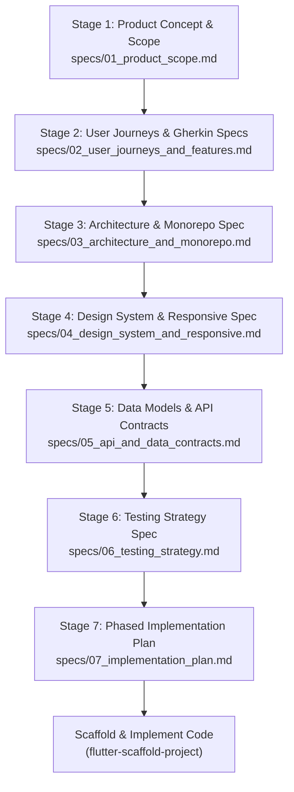

# Spec-Driven Development (SDD) for Flutter Applications

**Spec-Driven Development (SDD)** is an engineering methodology where formal, version-controlled specifications serve as the executable single source of truth (SSOT) before writing any application code. In SDD, requirements, architecture, API contracts, design tokens, and Gherkin test cases are completely specified and reviewed upfront to eliminate guesswork, rework, and hallucinated scope.

## Contents
- [Why Spec-Driven Development?](#why-spec-driven-development)
- [The 7-Stage SDD Framework](#the-7-stage-sdd-framework)
- [Interactive Specification Workflow](#interactive-specification-workflow)
- [Automated Spec Initialization](#automated-spec-initialization)
- [Spec Audit & Validation](#spec-audit--validation)
- [From Specs to Implementation](#from-specs-to-implementation)
- [References & Templates](#references--templates)

---

## Why Spec-Driven Development?

1. **Eliminates Code-First Churn**: Decouples requirements discovery from code writing. Design flaws and edge cases are resolved in markdown documents rather than through costly code refactorings.
2. **Deterministic AI Pair Programming**: AI coding assistants thrive when constrained by formal specs, preventing scope creep and unrequested dependencies.
3. **Behavior-Driven Testing**: Acceptance criteria defined in Gherkin (`Given / When / Then`) map directly to Riverpod ViewModel unit tests and Flutter `WidgetTester` test suites.
4. **Clean Monorepo Alignment**: Architecture specs directly inform workspace package boundaries (`apps/` vs `packages/`).

---

## The 7-Stage SDD Framework



### Stage 1: Product Concept & Scope (`specs/01_product_scope.md`)
- **Objective**: Define the app vision, user personas, problem statement, and MVP boundaries.
- **Key Artifacts**:
  - Target audience and problem statement.
  - Platform priority matrix: iOS, macOS Desktop, Web, Android.
  - Explicit In-Scope vs. Out-of-Scope guardrails.

### Stage 2: User Journeys & Gherkin Functional Specs (`specs/02_user_journeys_and_features.md`)
- **Objective**: Formalize behavioral requirements into executable acceptance criteria.
- **Key Artifacts**:
  - End-to-end user journeys.
  - User stories (`As a... I want... So that...`).
  - Gherkin acceptance criteria (`Given / When / Then`).
  - Edge case matrix (offline handling, network errors, empty states, permissions).

### Stage 3: Architecture & Monorepo Spec (`specs/03_architecture_and_monorepo.md`)
- **Objective**: Lock the architectural pattern, monorepo layout, and tech stack.
- **Key Artifacts**:
  - Workspace division: `apps/` (executable shells) and `packages/` (reusable feature modules).
  - Presentation pattern: MVVM (`router.config.dart`, `state/`, `viewmodel/`, `views/`).
  - Pinned tech stack: `flutter_riverpod`, `go_router`, `flutter_localizations`.

### Stage 4: Design System & Responsive Spec (`specs/04_design_system_and_responsive.md`)
- **Objective**: Specify the visual design language and multi-platform layouts.
- **Key Artifacts**:
  - Material 3 theme seeds, custom color tokens, dark/light modes.
  - Typography hierarchy and font families.
  - Responsive breakpoints: Compact (<600dp), Medium (600–840dp), Expanded (≥840dp).
  - Navigation paradigms (BottomBar vs. NavRail vs. NavDrawer).

### Stage 5: Data Models & API Contracts (`specs/05_api_and_data_contracts.md`)
- **Objective**: Define data structures, serialization, and networking boundaries.
- **Key Artifacts**:
  - Typed domain entities and data classes.
  - Sample JSON request and response payloads.
  - Standardized error response contract.
  - Abstract repository interfaces (`lib/domain/`).

### Stage 6: Testing Strategy Spec (`specs/06_testing_strategy.md`)
- **Objective**: Plan test coverage across the testing pyramid.
- **Key Artifacts**:
  - Gherkin-to-test mapping (acceptance criteria to Riverpod unit and widget tests).
  - Mocking boundaries (no live HTTP endpoints in tests).
  - CI/CD quality gates (`flutter analyze`, `flutter test`).

### Stage 7: Phased Implementation Plan & DoD (`specs/07_implementation_plan.md`)
- **Objective**: Break implementation into sequential milestones with clear exit criteria.
- **Key Artifacts**:
  - Milestone checklist (Foundation -> Scaffolding -> Presentation -> Integration).
  - Definition of Done (DoD) checklist.

---

## Interactive Specification Workflow

When defining specs interactively with the user, proceed **one stage at a time**:

1. **Prompt for Stage 1**: Inquire about app vision, target audience, and MVP boundaries. Author `specs/01_product_scope.md`.
2. **Review & Iterate**: Request user feedback or suggest the `/grill-me` command to stress-test requirements.
3. **Proceed Sequentially**: Move to Stage 2 (User Journeys) -> Stage 3 (Architecture) -> Stage 4 (Design System) -> Stage 5 (Data Contracts) -> Stage 6 (Testing) -> Stage 7 (Plan).
4. **Validate**: Run `./skills/flutter-spec-driven-development/scripts/validate_specs.sh` to ensure all placeholders are replaced.
5. **Execute**: Hand off to `flutter-scaffold-project` to generate the codebase.

---

## Automated Spec Initialization

To initialize a new `specs/` directory with all 7 templates in any Flutter repository:

```bash
./skills/flutter-spec-driven-development/scripts/init_specs.sh --dir .
```

This creates:
```text
specs/
├── README.md
├── 01_product_scope.md
├── 02_user_journeys_and_features.md
├── 03_architecture_and_monorepo.md
├── 04_design_system_and_responsive.md
├── 05_api_and_data_contracts.md
├── 06_testing_strategy.md
└── 07_implementation_plan.md
```

---

## Spec Audit & Validation

Verify that all specifications are complete and ready for development:

```bash
./skills/flutter-spec-driven-development/scripts/validate_specs.sh --dir .
```

The audit checks:
- All 7 spec files exist and are non-empty.
- No unedited `[TODO]` or `[e.g.` placeholder markers remain.
- Clear Definition of Done is established.

---

## From Specs to Implementation

Once specifications pass the readiness audit, scaffold the application using the companion scaffolding skill:

```bash
./skills/flutter-scaffold-project/scripts/scaffold_starter.sh \
  --name my_workspace \
  --app app \
  --org com.mycompany \
  --platforms ios,macos,web
```

---

## References & Templates

- [SDD Framework Guide](./references/sdd_framework_guide.md): Deep-dive into Spec-Driven Development principles and AI collaboration.
- [Gherkin in Flutter Guide](./references/gherkin_flutter_guide.md): How to map `Given / When / Then` scenarios to unit and widget tests.
- [Spec Readiness Checklist](./references/spec_driven_checklist.md): Comprehensive checklist to approve specs before coding.
- [Specification Templates](./templates/): Reusable templates for all 7 specification documents.
