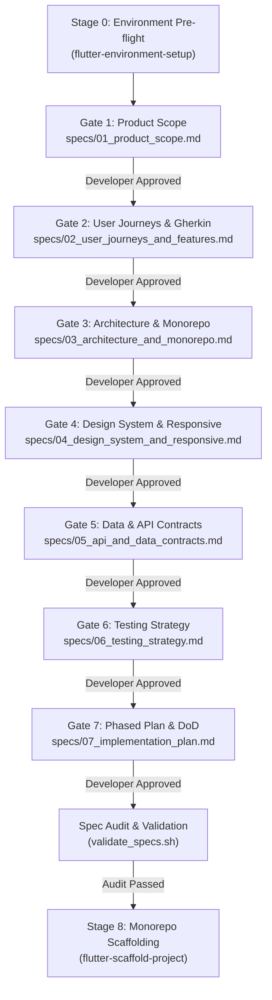
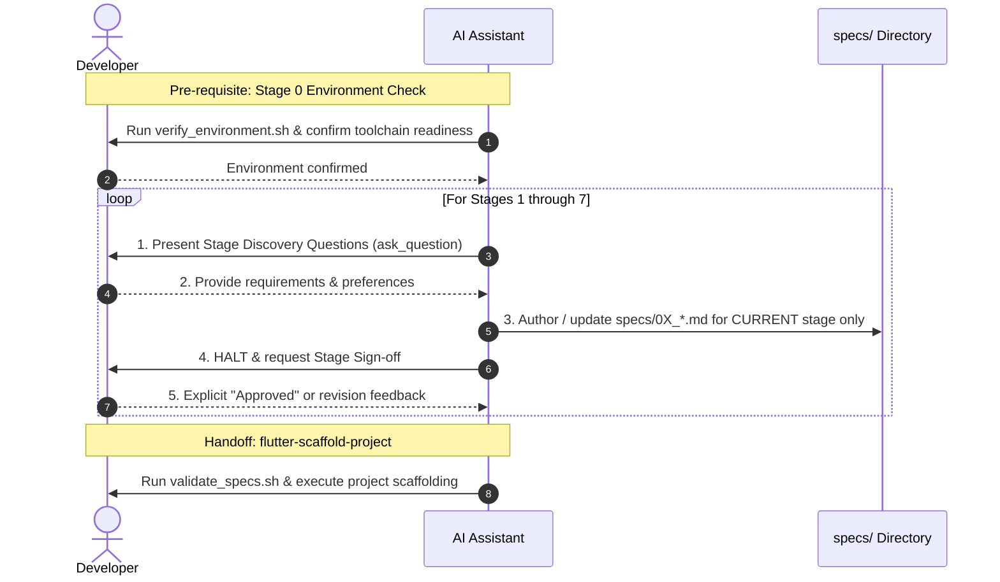

# Spec-Driven Development (SDD) for Flutter Applications

**Spec-Driven Development (SDD)** is an engineering methodology where formal, version-controlled specifications serve as the executable single source of truth (SSOT) before writing any application code. In SDD, requirements, architecture, API contracts, design tokens, and Gherkin test cases are completely specified, reviewed, and approved upfront to eliminate guesswork, rework, and hallucinated scope.

## Contents
- [The Complete Flutter Engineering Lifecycle](#the-complete-flutter-engineering-lifecycle)
- [Stage 0: Prerequisite Environment Verification](#stage-0-prerequisite-environment-verification-flutter-environment-setup)
- [The 7-Stage SDD Framework](#the-7-stage-sdd-framework)
- [Strict Stage Gating Protocol](#strict-stage-gating-protocol-mandatory)
  - [Gate 1: Product Concept & Scope](#gate-1-product-concept--scope-specs01_product_scopemd)
  - [Gate 2: User Journeys & Gherkin Specs](#gate-2-user-journeys--gherkin-specs-specs02_user_journeys_and_featuresmd)
  - [Gate 3: Architecture & Monorepo Spec](#gate-3-architecture--monorepo-spec-specs03_architecture_and_monorepomd)
  - [Gate 4: Design System & Responsive Spec](#gate-4-design-system--responsive-spec-specs04_design_system_and_responsivemd)
  - [Gate 5: Data Models & API Contracts](#gate-5-data-models--api-contracts-specs05_api_and_data_contractsmd)
  - [Gate 6: Testing Strategy Spec](#gate-6-testing-strategy-spec-specs06_testing_strategymd)
  - [Gate 7: Phased Implementation Plan & DoD](#gate-7-phased-implementation-plan--dod-specs07_implementation_planmd)
- [Spec Audit & Validation](#spec-audit--validation)
- [Stage 8: Enforced Code Scaffolding](#stage-8-enforced-code-scaffolding-flutter-scaffold-project)
- [References & Scripts](#references--scripts)

---

## The Complete Flutter Engineering Lifecycle

SDD connects environment readiness, specification authoring, and codebase scaffolding into an unbroken, gated pipeline:



---

## Stage 0: Prerequisite Environment Verification (`flutter-environment-setup`)

Before authoring any specifications or committing to platform targets, the developer's workstation **must be verified** using the `flutter-environment-setup` skill toolchain.

### Verification Steps:
1. **Run Diagnostic Verification Script**:
   ```bash
   ./skills/flutter-environment-setup/scripts/verify_environment.sh
   # (Or: ~/.gemini/config/skills/flutter-environment-setup/scripts/verify_environment.sh)
   ```
2. **Execute Doctor & Devices Checks**:
   ```bash
   flutter doctor -v
   flutter devices
   ```
3. **Platform Prerequisite Checklist**:
   - [ ] **Flutter / Dart SDK**: Flutter SDK (or FVM) installed and active on PATH.
   - [ ] **Web Target**: Google Chrome installed and `flutter config --enable-web` active.
   - [ ] **macOS Target**: Xcode active developer path configured (`xcode-select`), CocoaPods installed, and `flutter config --enable-macos-desktop` active.
   - [ ] **iOS Target**: Xcode command line tools, iOS Simulator runtime installed, CocoaPods installed.
   - [ ] **Android Target**: Android Studio, Android SDK (`cmdline-tools`), licenses accepted, and Java JDK 17/21 active.

> [!WARNING]
> **Toolchain Blockers**: If `verify_environment.sh` or `flutter doctor` flags missing SDKs or licenses for a platform that is in the project's target scope, **halt and alert the developer immediately**. Guide them to resolve toolchain issues using `flutter-environment-setup` before advancing to Stage 1.

---

## The 7-Stage SDD Framework

Specs reside in `specs/` as markdown documents that serve as the project's executable single source of truth:

| Stage | Document | Purpose |
|---|---|---|
| **1** | `specs/01_product_scope.md` | Problem statement, user personas, platform matrix, MVP boundaries |
| **2** | `specs/02_user_journeys_and_features.md` | User stories, Gherkin acceptance criteria (`Given/When/Then`), edge cases |
| **3** | `specs/03_architecture_and_monorepo.md` | Workspace layout (`apps/` vs `packages/`), MVVM, Riverpod, GoRouter |
| **4** | `specs/04_design_system_and_responsive.md` | Material 3 tokens, dark/light palettes, typography, responsive breakpoints |
| **5** | `specs/05_api_and_data_contracts.md` | Freezed domain entities, DTOs, request/response JSON schemas, repository interfaces |
| **6** | `specs/06_testing_strategy.md` | Testing pyramid, Gherkin-to-test mapping, mocking rules, CI quality gates |
| **7** | `specs/07_implementation_plan.md` | Phased development milestones, Definition of Done (DoD) |

---

## Strict Stage Gating Protocol (MANDATORY)

> [!CAUTION]
> ### THE HARD STOP RULE FOR AI ASSISTANTS
> 1. **ONE STAGE PER TURN**: The agent **MUST NOT** generate more than **ONE** specification stage in a single turn. Generating multiple specs in one pass without user interaction is a critical violation of SDD.
> 2. **INTERVIEW FIRST**: For every stage, the agent **MUST** present the stage's **Discovery Questions** to the developer (using `ask_question` or structured chat prompts) and capture their requirements before writing the file.
> 3. **STOP AND YIELD**: After authoring the spec document for Stage $N$, the agent **MUST STOP** execution and prompt the developer for review and explicit sign-off.
> 4. **GATE APPROVAL**: Stage $N+1$ is **LOCKED** until the developer explicitly confirms approval of Stage $N$.



---

### Gate 1: Product Concept & Scope (`specs/01_product_scope.md`)

#### Discovery Questions to Ask Developer:
1. What is the app name, elevator pitch, and core problem it solves?
2. Who are the primary and secondary user personas?
3. Which target platforms are required for the initial MVP release (iOS, macOS Desktop, Web, Android)? What are their priority tiers?
4. What are the **3 to 5 non-negotiable in-scope features** for the initial MVP?
5. What features are explicitly **out-of-scope** (deferred to post-MVP) to prevent scope creep?

#### Exit Criteria for Gate 1:
- `specs/01_product_scope.md` is authored with zero placeholders.
- Developer explicitly confirms: *"Stage 1 approved"*.

---

### Gate 2: User Journeys & Gherkin Specs (`specs/02_user_journeys_and_features.md`)

#### Discovery Questions to Ask Developer:
1. What are the primary end-to-end user journeys (from first launch to value delivery)?
2. For each in-scope feature, what are the user stories (`As a... I want... So that...`)?
3. What is the happy path acceptance criteria in Gherkin (`Given / When / Then`) format?
4. What critical error and edge case scenarios must be handled (offline connectivity, empty data states, permission denials, invalid inputs)?

#### Exit Criteria for Gate 2:
- `specs/02_user_journeys_and_features.md` contains behavioral Gherkin scenarios for every feature.
- Developer explicitly confirms: *"Stage 2 approved"*.

---

### Gate 3: Architecture & Monorepo Spec (`specs/03_architecture_and_monorepo.md`)

#### Discovery Questions to Ask Developer:
1. What modular feature packages should exist in `packages/` (e.g. `auth_feature`, `portfolio_feature`, `core_ui`)?
2. What state management approach is selected (`flutter_riverpod: ^3.3.2` with `Notifier<State>`)?
3. What routing strategy is required (`go_router` with package-level `router.config.dart` export)?
4. What local persistence mechanism is preferred (e.g. `shared_preferences`, `drift`, `hive`, or in-memory)?
5. What networking / HTTP library is required (e.g. `http`, `dio`, or mock client)?
6. What code generation dependencies are required for Freezed domain models (`freezed_annotation`, `json_annotation`, `build_runner`, `freezed`, `json_serializable`)?

#### Exit Criteria for Gate 3:
- `specs/03_architecture_and_monorepo.md` maps monorepo package boundaries and pinned dependencies (including Freezed and code generation).
- Confirms MVVM presentation architecture with Riverpod and GoRouter.
- Developer explicitly confirms: *"Stage 3 approved"*.

---

### Gate 4: Design System & Responsive Spec (`specs/04_design_system_and_responsive.md`)

#### Discovery Questions to Ask Developer:
1. What is the Material 3 brand seed color (`colorSchemeSeed`) and semantic color tokens (e.g. success, error, financial green/red)?
2. What theme modes are supported (Dark mode default, Light mode, or dynamic system matching)?
3. What typography hierarchy and font family should be used (e.g. Inter, Roboto, SF Pro)?
4. What are the responsive breakpoints (Compact <600dp, Medium 600–840dp, Expanded ≥840dp) and how does navigation adapt (NavigationBar vs NavigationRail vs NavigationDrawer)?
5. Are maximum content width constraints required for Desktop/Web (e.g. `BoxConstraints(maxWidth: 1200)`)?

#### Exit Criteria for Gate 4:
- `specs/04_design_system_and_responsive.md` defines tokens, typography, and responsive adaptation rules.
- Developer explicitly confirms: *"Stage 4 approved"*.

---

### Gate 5: Data Models & API Contracts (`specs/05_api_and_data_contracts.md`)

#### Discovery Questions to Ask Developer:
1. What are the primary domain entities and their typed fields (e.g. `HoldingPosition`, `UserProfile`)? *(All domain models must be defined as Freezed models using `@freezed` with `_$EntityName`, immutability, `copyWith`, and `fromJson`/`toJson` factory constructors)*
2. What are the API endpoints, HTTP methods, and required headers?
3. Is a mock/fake server engine required initially before integrating live third-party APIs?
4. What do realistic JSON 200 OK success payloads look like?
5. What is the standardized error response contract (error code, message, timestamp)?
6. What abstract repository interfaces (`lib/domain/`) are needed to decouple UI from networking?
7. What code generation command (`dart run build_runner build --delete-conflicting-outputs`) will generate the `*.freezed.dart` and `*.g.dart` implementations?

#### Exit Criteria for Gate 5:
- `specs/05_api_and_data_contracts.md` specifies typed Freezed models (`@freezed`), sample JSON payloads, serialization strategy, code generation commands, and repository interfaces.
- Developer explicitly confirms: *"Stage 5 approved"*.

---

### Gate 6: Testing Strategy Spec (`specs/06_testing_strategy.md`)

#### Discovery Questions to Ask Developer:
1. What is the coverage target for business logic (e.g. $\ge 80\%$ or $\ge 85\%$)?
2. How will Gherkin acceptance criteria from Stage 2 map to Riverpod unit tests and `WidgetTester` tests?
3. What are the mocking boundaries (e.g. mock repositories with zero live HTTP calls in unit tests)?
4. What CI/CD quality gate commands must pass before merging code (`flutter analyze`, `flutter test`)?

#### Exit Criteria for Gate 6:
- `specs/06_testing_strategy.md` defines test layers, Gherkin mapping patterns, and CI quality gates.
- Developer explicitly confirms: *"Stage 6 approved"*.

---

### Gate 7: Phased Implementation Plan & DoD (`specs/07_implementation_plan.md`)

#### Discovery Questions to Ask Developer:
1. What are the sequential implementation milestones (Phase 1 Foundation -> Phase 2 Features -> Phase 3 Presentation -> Phase 4 Hardening)?
2. What are the strict criteria for the **Definition of Done (DoD)**?
3. What platform smoke tests and device verification checks are required at delivery?

#### Exit Criteria for Gate 7:
- `specs/07_implementation_plan.md` contains an actionable milestone roadmap and DoD checklist.
- Developer explicitly confirms: *"Stage 7 approved"*.

---

## Spec Audit & Validation

Once all 7 stages have received developer sign-off, audit the entire specification suite for completeness:

```bash
./skills/flutter-spec-driven-development/scripts/validate_specs.sh --dir .
```

To audit an individual stage during the iterative gating process:
```bash
./skills/flutter-spec-driven-development/scripts/validate_specs.sh --dir . --stage 1
```

The audit checks:
- Required spec files exist and are non-empty ($\ge 100$ bytes).
- Zero unedited `[TODO]` or `[e.g.` placeholder markers remain.
- All acceptance criteria and contracts are concrete.

---

## Stage 8: Enforced Code Scaffolding (`flutter-scaffold-project`)

> [!IMPORTANT]
> **Enforced Scaffolding**: Code generation **MUST NOT** proceed with an arbitrary single-app structure. Once specs pass audit, the project **must be scaffolded using the architectural rules of the `flutter-scaffold-project` skill**, matching the monorepo architecture locked in `specs/03_architecture_and_monorepo.md` and `specs/07_implementation_plan.md`.

### Automated Scaffolding Command:
```bash
./skills/flutter-scaffold-project/scripts/scaffold_starter.sh \
  --name <workspace_name> \
  --app app \
  --org com.<company> \
  --platforms <platforms_from_spec_01>
```

*(Add `--fvm` if FVM was detected in Stage 0).*

### Architectural Rules Enforced by Scaffolding:
1. **Monorepo Structure**: Separate `apps/app` (executable shell) from modular `packages/<feature>_feature` libraries.
2. **MVVM Presentation Layer**: Every package enforces `presentation/state/`, `presentation/viewmodel/` (Riverpod `Notifier<State>`), and `presentation/views/`.
3. **Modular Routing**: Each package exports its `router.config.dart` defining `RouteBase` routes, mounted by the host app's central `GoRouter`.
4. **Package Localization**: Each package contains its own `l10n.yaml` and `.arb` translation files.
5. **Entitlements**: Host application runners configure native platform requirements (e.g. macOS network client sandbox entitlement).
6. **Isolated Tests**: Feature-level unit tests in `packages/*/test/` and host integration tests in `apps/app/test/`.
7. **Freezed Domain Models**: Domain entities in `packages/<feature>_feature/lib/domain/` are implemented as immutable Freezed models (`@freezed`) with `part '<entity>.freezed.dart';` and `part '<entity>.g.dart';`, generated via `build_runner`.

---

## References & Scripts

- [SDD Framework Guide](./references/sdd_framework_guide.md): Deep-dive into SDD principles and human-AI pair programming.
- [Gherkin in Flutter Guide](./references/gherkin_flutter_guide.md): Guide for mapping `Given / When / Then` scenarios to unit and widget tests.
- [Spec Readiness Checklist](./references/spec_driven_checklist.md): Comprehensive checklist to approve specs before coding.
- [Environment Verification Script](../flutter-environment-setup/scripts/verify_environment.sh): Stage 0 toolchain diagnostic script.
- [Automated Scaffolding Script](../flutter-scaffold-project/scripts/scaffold_starter.sh): Stage 8 starter workspace generator.
- [Spec Initialization Script](./scripts/init_specs.sh): Helper script supporting full or single-stage spec initialization.
- [Spec Audit Script](./scripts/validate_specs.sh): Helper script supporting full or single-stage audit validation.
