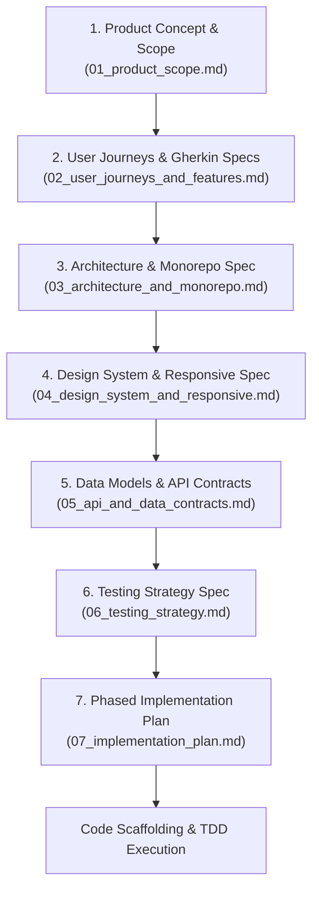

# Spec-Driven Development (SDD) Framework Guide for Flutter

## 1. What is Spec-Driven Development?

In **Spec-Driven Development (SDD)**, specifications are not an afterthought or documentation written post-facto—they are the **executable contract and single source of truth (SSOT)** that precedes any code generation.

### Code-First vs. Spec-Driven Development

| Dimension | Code-First Approach | Spec-Driven Development (SDD) |
|---|---|---|
| **Starting Point** | Writing Dart widgets and views immediately | Defining product scope, user journeys & Gherkin specs |
| **Architectural Decisions** | Ad-hoc, refactored repeatedly as issues arise | Explicitly decided upfront (monorepo, MVVM, routing) |
| **API & Data Modeling** | Dictated by UI widgets as screens are built | Formalized in typed data contracts & repository interfaces |
| **Testing** | Written after implementation (often skipped) | Acceptance criteria mapped 1:1 to test suites before coding |
| **AI Pair Programming** | Model hallucinates scope, loses context, rewrites code | Model references explicit spec files as immovable constraints |

---

## 2. The 7-Stage SDD Lifecycle

### Stage 1: Product Concept & Scope (`01_product_scope.md`)
- Clarifies the "why" and "who" before touching tech.
- Establishes non-negotiable MVP boundaries and deferred features.
- Defines the target platform matrix (e.g. iOS, macOS Desktop, Web).

### Stage 2: User Journeys & Gherkin Specs (`02_user_journeys_and_features.md`)
- Captures behavior from the user's perspective.
- Formalizes scenarios in strict `Given / When / Then` format.
- Enumerates edge cases (offline, network errors, empty states, permissions).

### Stage 3: Architecture & Monorepo Spec (`03_architecture_and_monorepo.md`)
- Establishes the Monorepo structure (`apps/` for shells, `packages/` for features).
- Enforces MVVM in presentation (`router/`, `state/`, `viewmodel/`, `views/`).
- Fixes dependencies (`flutter_riverpod`, `go_router`, `flutter_localizations`).

### Stage 4: Design System & Responsive Spec (`04_design_system_and_responsive.md`)
- Defines Material 3 color seeds, typography, and dark/light tokens.
- Specifies responsive breakpoints (Compact < 600dp, Medium 600–840dp, Expanded ≥ 840dp).
- Specifies layout adaptation (BottomNav vs NavigationRail vs NavigationDrawer).

### Stage 5: Data Models & API Contracts (`05_api_and_data_contracts.md`)
- Freezes domain entity definitions and DTO schemas.
- Defines JSON structures with concrete samples.
- Formalizes abstract repository interfaces in `lib/domain/`.

### Stage 6: Testing Strategy Spec (`06_testing_strategy.md`)
- Maps every Gherkin scenario to a unit or widget test target.
- Formulates mock boundaries (no live HTTP calls during tests).
- Establishes CI quality gates (`flutter analyze`, `flutter test`).

### Stage 7: Phased Implementation Plan (`07_implementation_plan.md`)
- Translates the specs into phased, sequential development tasks.
- Defines the checklist for the Definition of Done (DoD).

---

## 3. Maintaining Spec Integrity During Development

1. **Specs are Living Contracts**: If requirements change during implementation, the spec must be updated **first**, reviewed, and then code updated to match.
2. **Never Implement Undocumented Features**: If a feature is not in `01_product_scope.md` or `02_user_journeys_and_features.md`, it must not be added to code.
3. **Spec Alignment Check**: Every pull request or milestone review verifies code against the specs before merging.
