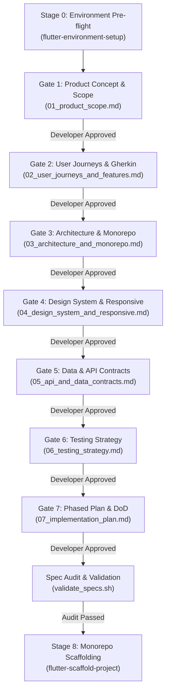

# Spec-Driven Development (SDD) Framework Guide for Flutter

## 1. What is Spec-Driven Development?

In **Spec-Driven Development (SDD)**, specifications are not an afterthought or documentation written post-facto—they are the **executable contract and single source of truth (SSOT)** that precedes any code generation.

### Code-First vs. Spec-Driven Development

| Dimension | Code-First Approach | Spec-Driven Development (SDD) |
|---|---|---|
| **Environment Readiness** | Discovers missing SDKs/Xcode during compile errors | Pre-flight verified upfront via `flutter-environment-setup` |
| **Starting Point** | Writing Dart widgets and views immediately | Defining product scope, user journeys & Gherkin specs |
| **Architectural Decisions** | Ad-hoc, refactored repeatedly as issues arise | Explicitly decided upfront (monorepo, MVVM, routing) |
| **API & Data Modeling** | Dictated by UI widgets as screens are built | Formalized in typed Freezed domain models (`@freezed`) & repository interfaces |
| **Testing** | Written after implementation (often skipped) | Acceptance criteria mapped 1:1 to test suites before coding |
| **AI Pair Programming** | Model hallucinates scope, loses context, rewrites code | Model constrained by strictly gated stages and verified specs |
| **Code Scaffolding** | Single ad-hoc app shell | Standardized monorepo (`apps/` + `packages/`) via `flutter-scaffold-project` |

---

## 2. The Complete Gated SDD Lifecycle

### Stage 0: Prerequisite Environment Verification (`flutter-environment-setup`)
- Runs `verify_environment.sh` or `flutter doctor -v` and `flutter devices`.
- Validates Flutter SDK/FVM, Google Chrome (Web), Xcode/CocoaPods (macOS/iOS), and Android SDK/Java.
- Resolves toolchain blockers before drafting specifications.

### Gate 1: Product Concept & Scope (`01_product_scope.md`)
- Clarifies the "why", "who", and core problem before touching tech.
- Establishes non-negotiable MVP boundaries and deferred features.
- Defines the target platform matrix (iOS, macOS Desktop, Web, Android).

### Gate 2: User Journeys & Gherkin Specs (`02_user_journeys_and_features.md`)
- Captures behavior from the user's perspective.
- Formalizes scenarios in strict `Given / When / Then` format.
- Enumerates edge cases (offline, network errors, empty states, permissions).

### Gate 3: Architecture & Monorepo Spec (`03_architecture_and_monorepo.md`)
- Establishes the Monorepo structure (`apps/` for shells, `packages/` for features).
- Enforces MVVM in presentation (`router/`, `state/`, `viewmodel/`, `views/`).
- Fixes dependencies (`flutter_riverpod`, `go_router`, `flutter_localizations`, `freezed_annotation`).

### Gate 4: Design System & Responsive Spec (`04_design_system_and_responsive.md`)
- Defines Material 3 color seeds, typography, and dark/light tokens.
- Specifies responsive breakpoints (Compact <600dp, Medium 600–840dp, Expanded ≥840dp).
- Specifies layout adaptation (BottomNav vs NavigationRail vs NavigationDrawer).

### Gate 5: Data Models & API Contracts (`05_api_and_data_contracts.md`)
- Specifies domain entities as immutable Freezed models (`@freezed`) with `fromJson`/`toJson` code generation.
- Defines JSON structures with concrete sample payloads.
- Configures code generation (`dart run build_runner build --delete-conflicting-outputs`).
- Formalizes abstract repository interfaces in `lib/domain/`.

### Gate 6: Testing Strategy Spec (`06_testing_strategy.md`)
- Maps every Gherkin scenario to a unit or widget test target.
- Formulates mock boundaries (no live HTTP calls during tests).
- Establishes CI quality gates (`flutter analyze`, `flutter test`).

### Gate 7: Phased Implementation Plan (`07_implementation_plan.md`)
- Translates the specs into phased, sequential development tasks.
- Defines the checklist for the Definition of Done (DoD).

### Stage 8: Monorepo Code Scaffolding (`flutter-scaffold-project`)
- Generates the workspace (`apps/` and `packages/`) using `scaffold_starter.sh`.
- Instantiates MVVM layers, Riverpod notifiers, GoRouter configs, and l10n.
- Wires entitlements and executes verification test runs.

---

## 3. Maintaining Spec Integrity During Development

1. **Specs are Living Contracts**: If requirements change during implementation, the spec must be updated **first**, reviewed, and then code updated to match.
2. **Never Implement Undocumented Features**: If a feature is not in `01_product_scope.md` or `02_user_journeys_and_features.md`, it must not be added to code.
3. **Spec Alignment Check**: Every pull request or milestone review verifies code against the specs before merging.
